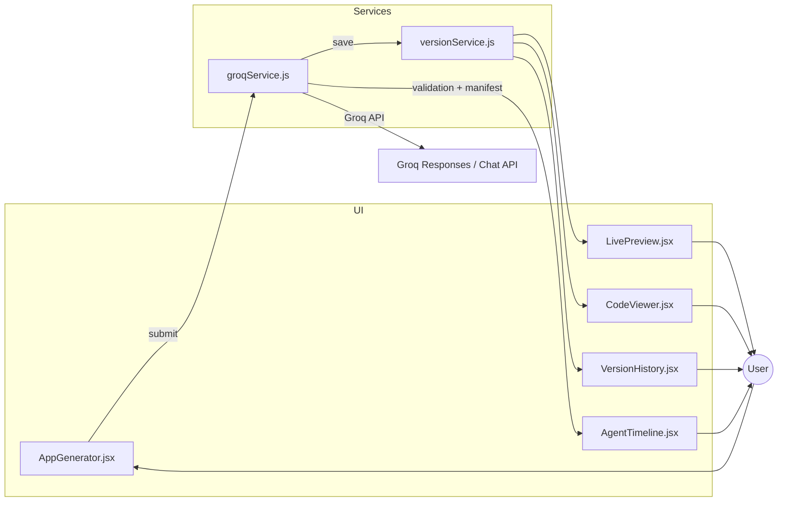

# Morphic Web - Revolutionary Instant App Creation

Transform natural language ideas into fully-working web applications in seconds using Groq's powerful LLMs.

## 🚀 Features

### Instant App Generation
- **Natural Language Input**: Describe your app idea in plain English
- **Immediate Results**: Get working React applications in seconds
- **Preview Sandbox**: Generated code renders instantly inside an isolated iframe

### Groq-Powered AI
- **Model Selection**: Choose from multiple Groq models (Compound, Compound Mini, Llama 3.3/3.1, GPT-OSS, Llama 4, Kimi K2, Qwen3, Mixtral, Gemma)
- **Multi-Pass Workflow**: Automatic blueprint → implementation flow for higher quality apps
- **CDN-Only Architecture**: Generated apps use only browser-safe CDN packages for instant preview

### Advanced Capabilities
- **Live Preview**: Instant browser preview of generated apps
- **Dynamic Preview & AI Repair**: The preview now auto-detects libraries and injects CDNs dynamically using `src/lib/previewRuntime.js`.
- **Code Viewer**: Syntax-highlighted code editor with Monaco
- **Version History**: Track and manage all your generated apps
- **Export/Import**: Download full projects or individual components
- **Guardrails**: Sanitization, prompt-injection defenses, and CDN-only package enforcement built into `groqService`

### Modern UI/UX
- **Beautiful Interface**: Glass-morphism design with smooth animations
- **Responsive**: Works perfectly on desktop, tablet, and mobile
- **Dark Theme**: Easy on the eyes with modern aesthetics

## 🛠 Tech Stack

- **Frontend**: React 18, Vite, TailwindCSS
- **Code Editor**: Monaco Editor
- **Icons**: Lucide React
- **AI Provider**: Groq API (exclusively)
- **Storage**: Local Storage for versions and settings
- **Agent Services**: `groqService.js` orchestrates multi-pass blueprint and implementation generation

## 📦 Installation

1. **Clone the repository**
   ```bash
   git clone <repository-url>
   cd morphic-web
   ```

2. **Install dependencies**
   ```bash
   npm install
   ```

3. **Start development server**
   ```bash
   npm run dev
   ```

4. **Get your Groq API key**
   - Visit [console.groq.com](https://console.groq.com)
   - Sign up for free
   - Create an API key
   - Enter it in the app when prompted

## 🎯 How It Works

### 1. Describe Your App
Enter a natural language description of your app idea:
- "AI-powered todo list with smart categorization"
- "Real-time weather dashboard with beautiful animations"
- "Interactive memory card game with scoring"

### 2. Choose Configuration
- **Template**: Select from optimized app templates
- **Model**: Pick your preferred Groq model
- **AI Features**: Enable AI capabilities if needed

### 3. Generate & Preview (Current Flow)
- Groq generates professional React code in a single pass
- Instant live preview in browser
- View and edit the generated code
- Export full projects

### 3.1 Dynamic Preview & AI Repair
- The preview now auto-detects libraries and injects CDNs dynamically using `src/lib/previewRuntime.js`.
- `src/components/LivePreview.jsx` first tries dynamic injection; on preview errors, click "Fix Preview (AI)" to request a strict JSON Preview Manifest from Groq.
- The manifest is persisted per version via `versionService.updateVersion()` and rendered via the manifest path.
- This keeps previews resilient without npm installs, relying only on browser-safe CDNs and fallbacks.

### 4. Version Control & Guardrails
- All apps automatically saved to local storage
- Browse version history, import/export snapshots
- Preview manifest warnings and guardrail alerts surface in the Agent Timeline

> **Heads up:** The multi-pass workflow (Blueprint → Implementation → Enhancement) is under active development. See `PROJECT_PENDING.md` for the migration plan.

## 🔄 Current Workflow

### Generate Tab
- **Step 1** – Describe your idea in `AppGenerator`: select model, toggle MCP tools, and submit the concept.
- **Step 2** – `App.jsx` composes a prompt and calls `groqService.runAgenticWorkflow()` (single pass today).
- **Step 3** – The response is validated (`groqService.validateCode()`), stored via `versionService`, and previewed.

### Preview / Code Tabs
- **LivePreview** renders the latest code inside a sandbox with CDN helpers.
- **CodeViewer** exposes Monaco editing with autosave into `versionService` and a live preview refresh.

### History Tab
- Search, filter, export, or delete saved apps.
- Selecting an entry hydrates the preview, code editor, and Agent Timeline.

## 🧱 Architecture Overview



### Key Notes
- `groqService` detects Groq compound models and routes them through the Responses API with MCP tool support.
- `versionService` centralizes persistence, enabling quick hydration across tabs.
- Blueprint/implementation helpers already exist and will be wired into the UI in the upcoming multi-pass release.

## 🔧 Architecture

### Prompt System (`/src/prompts/`)
- **Multi-pass templates**: `buildBlueprintPrompt()`, `buildImplementationPrompt()`, `buildEnhancementPrompt()`
- **Guardrail builder**: `buildGuardrailRules()` assembles tone, accessibility, security, and CDN expectations
- **Fallback mechanisms**: Guardrails prevent unsafe assets and inject markdown renderer guidance

### Services (`/src/services/`)
- **GroqService**: API integration and code generation
- **VersionService**: Local storage and version management

### Components (`/src/components/`)
- **AppGenerator**: Main generation interface
- **LivePreview**: Sandboxed app preview
- **CodeViewer**: Monaco-based code editor
- **VersionHistory**: Version management UI
- **ApiKeyModal**: Secure API key configuration

## 🎨 App Templates

### Basic App
General-purpose applications with clean interfaces

### AI Chat App
Conversational interfaces with Groq integration

### Dashboard
Data visualization and management interfaces

### Interactive Game
Engaging games with state management

### Utility Tool
Functional tools and calculators

## 🔐 Security

- **Local Storage**: API keys stored securely in browser
- **No Server**: Direct communication with Groq API
- **Sandboxed Preview**: Safe code execution environment
- **Input Sanitization**: Clean and validate all generated code

## 🚀 Deployment

### Build for Production
```bash
npm run build
```

### Deploy to Netlify/Vercel
The app is a static React application that can be deployed to any static hosting service.

## 📝 Usage Examples

### Todo App with AI
```
"Create a todo app with AI-powered task prioritization, deadline suggestions, and smart categorization based on task content"
```

### Weather Dashboard
```
"Build a weather dashboard showing current conditions, 7-day forecast, interactive maps, and beautiful weather animations"
```

### Memory Game
```
"Design an interactive memory card game with multiple difficulty levels, scoring system, and progress tracking"
```

## 🤝 Contributing

1. Fork the repository
2. Create your feature branch (`git checkout -b feature/amazing-feature`)
3. Commit your changes (`git commit -m 'Add amazing feature'`)
4. Push to the branch (`git push origin feature/amazing-feature`)
5. Open a Pull Request

## 📄 License

This project is licensed under the MIT License - see the LICENSE file for details.

## 🙏 Acknowledgments

- **Groq** for providing fast, powerful LLM inference
- **React Team** for the amazing framework
- **Tailwind CSS** for beautiful, utility-first styling
- **Monaco Editor** for the professional code editing experience

## 🔮 Future Enhancements

- [ ] Real-time collaboration
- [ ] Custom component library
- [ ] Advanced AI integrations
- [ ] Cloud deployment integration
- [ ] Team workspaces
- [ ] Plugin system

---

**Built with ❤️ using Groq AI and modern web technologies**
