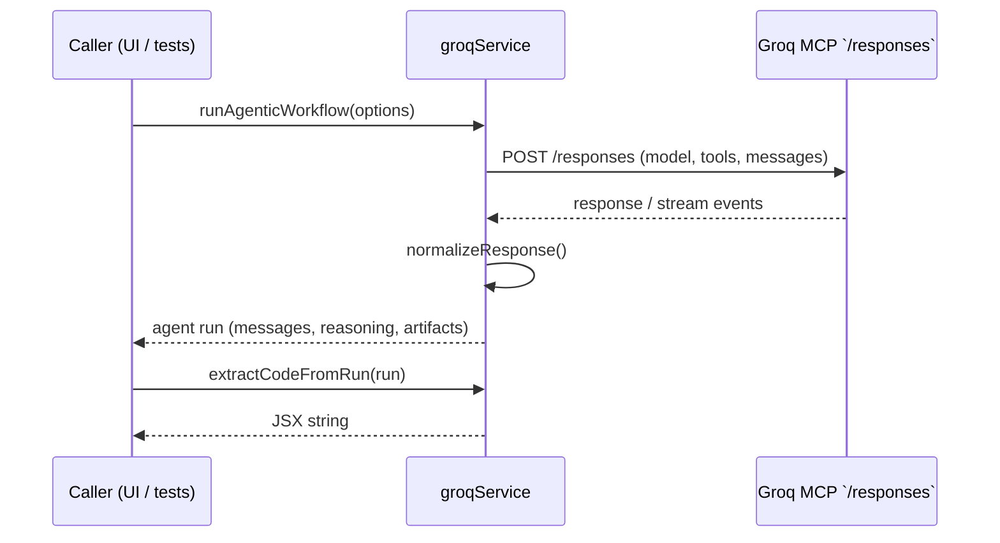

# Phase 1 – Groq MCP Service Migration

## Objectives
- **Modernize** the Groq integration to use the Model Context Protocol (MCP) `/responses` endpoint.
- **Expose** rich agent telemetry (messages, reasoning, tool calls, artifacts) for downstream UI features.
- **Maintain** backward compatibility so legacy flows can still call `generateCode()`.

## Key Changes
- **`src/services/groqService.js`** was rewritten around MCP:
  - Added curated `SUPPORTED_MODELS`, default tool registry, and configuration helpers.
  - Implemented `runAgenticWorkflow()` with optional streaming support and robust response normalization.
  - Added `extractCodeFromRun()` so JSX can be recovered from artifacts or plain text outputs.
  - Preserved `sanitizeCode()` / `validateCode()` for legacy safety checks.
- **State Plumbing**: `groqService` now stores the most recent run for debugging via `getLastRun()`.

## Agent Flow

## Tooling & Configuration
- **Tool registry** defaults to Groq’s built-ins (`web-search`, `code-execution`, `browser`, `vision`).
- Consumers can call `configureTools()` to enable/disable or add custom MCP endpoints.
- Request metadata (template, idea, enabled tools) is forwarded for observability.

## Compatibility Notes
- Existing callers can still use `generateCode(prompt, model)`; under the hood it now issues an MCP run with a stricter system prompt.
- The service defends against malformed outputs by checking artifacts, JSON payloads, and fallback assistant messages before sanitizing JSX.

## Next Steps
- Surface the richer MCP data in the UI (completed in Phase 2).
- Feed MCP-generated preview manifests into the renderer (planned Phase 3).
- Extend tooling registry UI so users can connect third-party MCP providers.
