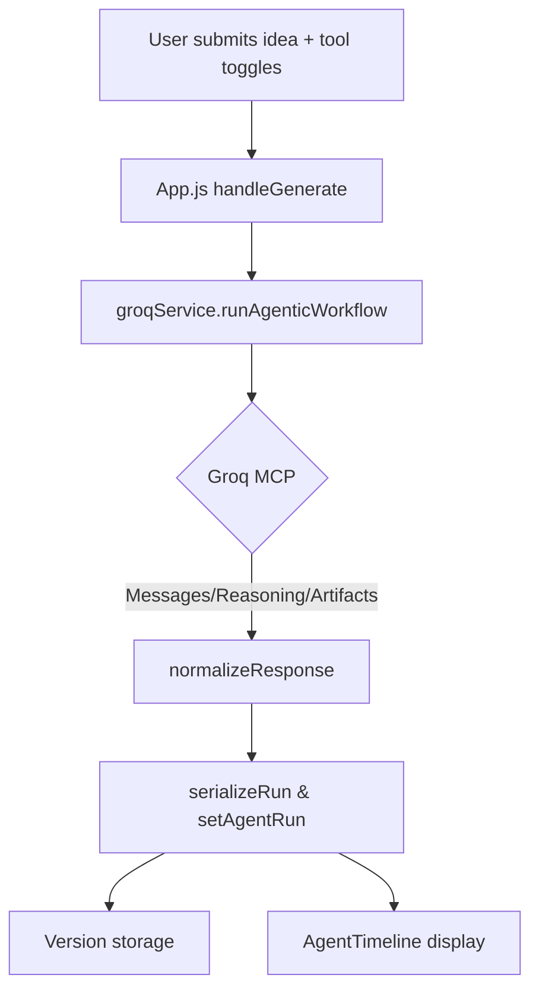

# Phase 2 – Agentic UI & Telemetry Integration

## Objectives
- **Expose** Groq MCP agent capabilities directly to users (model, tools, reasoning).
- **Capture** and persist agent telemetry (reasoning steps, tool calls, artifacts) with each generated app.
- **Prepare** the renderer pipeline for Phase 3’s agent-authored preview manifests.

## Key Changes
- **`src/App.js`**
  - Added tool preference state, model dropdown alignment, and new `AGENT_SYSTEM_PROMPT`.
  - Calls `groqService.runAgenticWorkflow()` for generation, serializes the run, and stores it with the app.
  - Introduced `AgentTimeline` in Generate/Preview/Code views to visualize reasoning steps and tool calls.
  - Persists tool selections and agent telemetry in local storage via `versionService`.
- **`src/components/AppGenerator.jsx`**
  - Converted to a controlled component receiving app idea, model, and tool settings from the parent.
  - Added UI to toggle Groq MCP tools with descriptive copy aligned to `TOOL_DEFINITIONS`.
- **`src/components/AgentTimeline.jsx`**
  - New component that renders summaries, reasoning entries, and tool invocations with graceful empty/loading states.
- **`src/services/versionService.js`**
  - Now saves `agentRun`, `toolPreferences`, and optional MCP metadata for every version.
  - Restores preferences when a version is reloaded, keeping the agent context in sync.

## Agentic Request Flow

## Telemetry Persistence
- Each saved app version now contains:
  - `agentRun.finalText` for debugging.
  - `agentRun.reasoning` array for timeline replay.
  - `toolPreferences` so future runs start with the same tool configuration.
  - Optional `metadata` returned by Groq.

## UX Highlights
- Tool toggles are surfaced during generation, encouraging purposeful agent behavior.
- Agent timeline provides transparency and supports future debugging or editing of intermediate steps.
- Generate/Preview/Code tabs all show the same telemetry to keep context intact while iterating.

## Next Steps
- Phase 3 will let the agent author preview manifests so the iframe can load any CDN bundle safely.
- Phase 4+ will expose tool configuration management (custom MCP providers) and embed logs for exports.
- Update `src/App.jsx` (standalone entry) to mirror the MCP workflow for parity with the main React entry.
