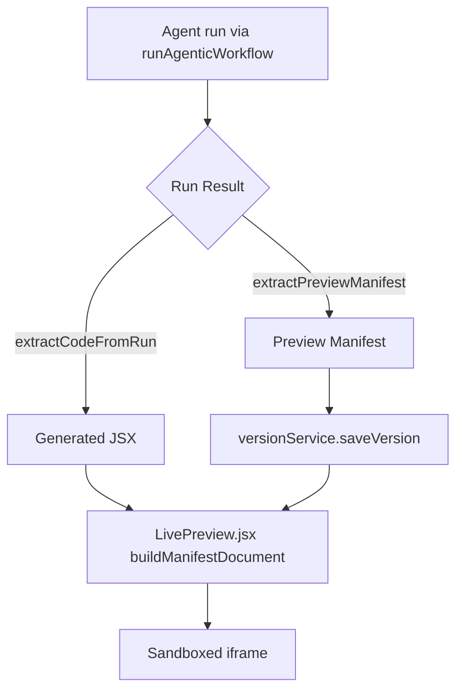

# Phase 3 – Agent Authored Preview Manifests

## Objectives
- **Empower** Groq’s MCP agent to deliver complete preview manifests so any CDN/library mix can be rendered sandbox-safe.
- **Eliminate** hard-coded runtime fallbacks by trusting the agent’s assets while preserving a legacy path for older versions.
- **Deepen** guardrails so agent output is intelligent, secure, and visually breathtaking every time.

## Key Changes
- **`src/services/groqService.js`**
  - Added `extractPreviewManifest()` to collect and sanitize manifest artifacts returned by MCP runs.
  - Existing `extractCodeFromRun()` and `runAgenticWorkflow()` now feed both JSX and manifest data to the UI layer.
- **`src/App.js`**
  - Refined `AGENT_SYSTEM_PROMPT` with strict UX/AI guardrails.
  - Removed fallback shell generation; we now rely on agents to succeed or raise actionable errors.
  - Stores `previewManifest` beside `agentRun`, and serializes manifest summaries for telemetry.
- **`src/components/LivePreview.jsx`**
  - Rebuilt preview renderer to honor agent manifests, injecting custom scripts/styles while escaping inline content.
  - Keeps legacy Babel path for historical versions lacking manifests.
- **`src/services/versionService.js`**
  - Persists `previewManifest` for each saved version and ensures reload parity.
- **Prompts (`src/prompts/templates.js`)**
  - Expanded base template to demand premium UI, AI reasoning, and robust prompt-injection resistance.

## Manifest Rendering Flow


## Guardrail Enhancements
- Agent prompt enforces intelligent AI usage (decision engines, not just chat), secure API handling, and injection defenses.
- Templates instruct the agent to design for delight: animations, microcopy, and polished visuals are mandatory.
- Preview renderer sanitizes inline styles/scripts and defaults to trusted CDNs when manifests omit entries.

## Testing Checklist
- Generate representative apps (AI-heavy, data dashboards, games) and verify manifests load without console errors.
- Toggle tool registry to confirm preview still succeeds when optional tools (browser/code-execution) are enabled.
- Inspect `AgentTimeline.jsx` to ensure manifest summaries appear for new runs.

## Next Steps
- Phase 4 will:
  - Surface guardrail compliance and manifest metadata directly in the timeline UI.
  - Synchronize `src/App.jsx` with the MCP workflow for standalone builds.
  - Add automated validation or linting around provided manifests to catch unsupported assets sooner.
```
