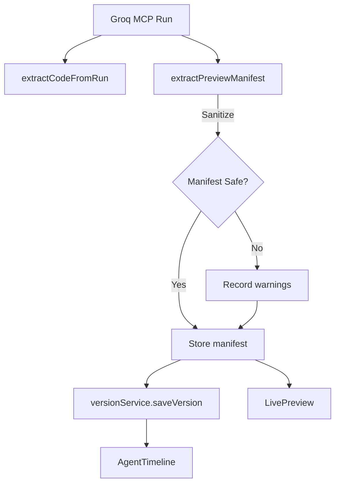

# Phase 4 – Guardrails, Telemetry & Manifest Enforcement

## Objectives
- **Enforce** agent-authored preview manifests as a hard requirement for rendering, eliminating legacy fallbacks.
- **Surface** guardrail telemetry (manifest metadata + sanitization warnings) directly in the UI for transparency.
- **Align** both React entry points (`src/App.js`, `src/App.jsx`) with the Phase 3/4 guardrail workflow so standalone builds behave identically.

## Key Changes
- **`src/services/groqService.js`**
  - Added URL sanitization (`isSafeAssetUrl`) and warning capture inside `extractPreviewManifest()`.
  - Manifest extraction now attaches `warnings` when unsafe assets are stripped.
- **`src/components/LivePreview.jsx`**
  - `createPreviewDocument()` now throws if no manifest is present, ensuring manifests are required.
  - Preview loaders, refresh, and export flows all render via the manifest-driven runtime and surface readable error states.
- **`src/services/versionService.js`**
  - Persists `guardrailWarnings` with each saved version and when setting the current app.
- **`src/App.js` & `src/App.jsx`**
  - Store `guardrailWarnings` on every generation run; pass them through to `AgentTimeline`.
  - `serializeRun()` emits manifest summaries (script/style counts, entry type) so the UI can visualize manifest composition.
- **`src/components/AgentTimeline.jsx`**
  - New panels display guardrail warnings and manifest summaries alongside reasoning/tool usage.

## Guardrail & Manifest Flow


## User Experience
- The preview now fails fast with actionable messaging if a manifest is missing or invalid, prompting regeneration instead of silently falling back.
- Timeline cards summarize manifest shape and list any assets the guardrails removed.
- History entries retain guardrail context so revisiting earlier generations keeps the same transparency.

## Validation Checklist
- Generate multiple app ideas (AI + non-AI) to confirm manifests render and warnings appear when expected.
- Toggle tool registry settings and ensure guardrail telemetry persists across saved versions and reloads.
- Verify exporting a version still produces a manifest-inclusive payload.

## Next Steps
- Add automated tests for manifest sanitization and guardrail warning propagation.
- Explore manifest supplements (e.g., streaming partial manifests) to improve resilience.
- Extend timeline to flag prompt-injection attempts or other rule violations detected during generation.
```
